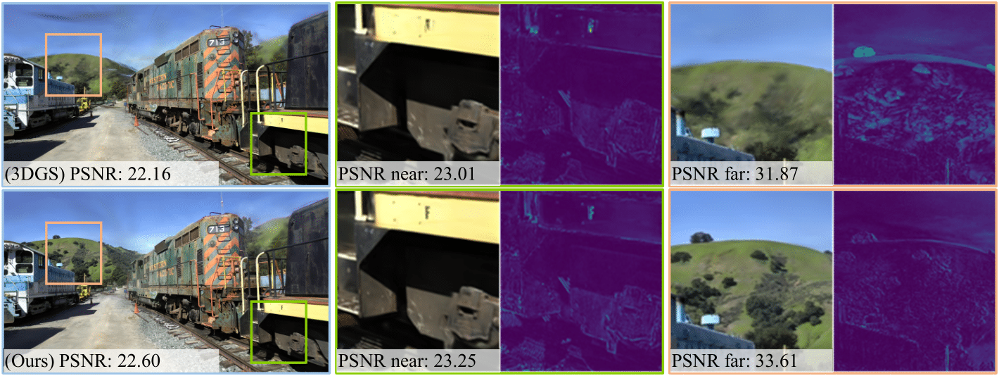

# HoGS: Unified Near and Far Object Reconstruction via Homogeneous Gaussian Splatting (CVPR2025)
## Xinpeng Liu<sup>1*</sup>, Zeyi Huang<sup>1*</sup>, Fumio Okura<sup>1</sup>, Yasuyuki Matsushita<sup>1,2</sup>  <br> <sup>1</sup> The University of Osaka, <sup>2</sup> Microsoft Research Asia Tokyo <br>(* indicates equal contribution)
[](https://arxiv.org/abs/xxxx.xxxxx) 
| [Webpage](https://homogeneous-gaussian-splatting.github.io/hogs.github.io/)|<br>



Homogeneous Gaussian Splatting (HoGS) uses homogeneous coordinates in the 3D Gaussian Splatting (3DGS) framework to represent both positions and scales. Homogeneous coordinates defined in the projective geometry represent nearby and distant objects seamlessly, thus our HoGS enables the accurate rendering of unbounded scenes while preserving the 3DGS's fast training time and real-time performance. Compared to the traditional 3DGS, HoGS demonstrates improved robustness in capturing distant details while maintaining high fidelity in near-field objects.

Abstract: *Novel view synthesis has demonstrated impressive progress recently, with 3D Gaussian splatting (3DGS) offering efficient training time and photorealistic real-time rendering. However, reliance on Cartesian coordinates limits 3DGS's performance on distant objects, which is important for reconstructing unbounded outdoor environments. We found that, despite its ultimate simplicity, using homogeneous coordinates, a concept on the projective geometry, for the 3DGS pipeline remarkably improves the rendering accuracies of distant objects. We therefore propose Homogeneous Gaussian Splatting (HoGS) incorporating homogeneous coordinates into the 3DGS framework, providing a unified representation for enhancing near and distant objects. HoGS effectively manages both expansive spatial positions and scales particularly in outdoor unbounded environments by adopting projective geometry principles. Experiments show that HoGS significantly enhances accuracy in reconstructing distant objects while maintaining high-quality rendering of nearby objects, along with fast training speed and real-time rendering capability.*

<section class="section" id="BibTeX">
  <div class="container is-max-desktop content">
    <h2 class="title">BibTeX</h2>
    <pre><code>@inproceedings{liuHoGS,
      author       = {Xinpeng Liu, Zeyi Huang, Fumio Okura, Yasuyuki Matsushita},
      title        = {HoGS: Unified Near and Far Object Reconstruction via Homogeneous Gaussian Splatting},
      booktitle    = {Proceedings of the IEEE/CVF Conference on Computer Vision and Pattern Recognition (CVPR)},
      year         = {2025}
}</code></pre>
  </div>
</section>

## Funding and Acknowledgments

This work was partially supported by JSPS KAKENHI Grant JP23H05491 and JST FOREST Grant JPMJFR206F.

## Cloning the Repository

The repository contains submodules, thus please check it out with 
```shell
# SSH
git clone git@github.com:huntorochi/HoGS.git --recursive
```
or
```shell
# HTTPS
git clone https://github.com/huntorochi/HoGS.git
```

## Overview

The codebase has 4 main components:
- A PyTorch-based optimizer to produce a 3D Gaussian model from SfM inputs
- A network viewer that allows to connect to and visualize the optimization process
- An OpenGL-based real-time viewer to render trained models in real-time.
- A script to help you turn your own images into optimization-ready SfM data sets

The components have different requirements w.r.t. both hardware and software. They have been tested on Windows 10 and Ubuntu Linux 22.04. Instructions for setting up and running each of them are found in the sections below.


## Optimizer

The optimizer uses PyTorch and CUDA extensions in a Python environment to produce trained models. 

### Hardware Requirements

- CUDA-ready GPU with Compute Capability 7.0+
- 24 GB VRAM (to train to paper evaluation quality)
- Please see FAQ for smaller VRAM configurations

### Software Requirements
- Conda (recommended for easy setup)
- C++ Compiler for PyTorch extensions (we used Visual Studio 2019 for Windows)
- CUDA SDK 11 for PyTorch extensions, install *after* Visual Studio (we used 11.8, **known issues with 11.6**)
- C++ Compiler and CUDA SDK must be compatible

### Setup

#### Local Setup

Our default, provided install method is based on Conda package and environment management:
```shell
SET DISTUTILS_USE_SDK=1 # Windows only
conda env create --file environment.yml
conda activate gaussian_splatting
```
Please note that this process assumes that you have CUDA SDK **11** installed, not **12**. For modifications, see below.

Tip: Downloading packages and creating a new environment with Conda can require a significant amount of disk space. By default, Conda will use the main system hard drive. You can avoid this by specifying a different package download location and an environment on a different drive:

```shell
conda config --add pkgs_dirs <Drive>/<pkg_path>
conda env create --file environment.yml --prefix <Drive>/<env_path>/gaussian_splatting
conda activate <Drive>/<env_path>/gaussian_splatting
```

#### Modifications

If you can afford the disk space, we recommend using our environment files for setting up a training environment identical to ours. If you want to make modifications, please note that major version changes might affect the results of our method. However, our (limited) experiments suggest that the codebase works just fine inside a more up-to-date environment (Python 3.8, PyTorch 2.0.0, CUDA 12). Make sure to create an environment where PyTorch and its CUDA runtime version match and the installed CUDA SDK has no major version difference with PyTorch's CUDA version.

#### Known Issues

Some users experience problems building the submodules on Windows (```cl.exe: File not found``` or similar). Please consider the workaround for this problem from the FAQ.

### Running

To run the optimizer, simply use

```shell
python train.py -s <path to COLMAP or NeRF Synthetic dataset>
```

<details>
<summary><span style="font-weight: bold;">Command Line Arguments for train.py</span></summary>

  #### --source_path / -s
  Path to the source directory containing a COLMAP or Synthetic NeRF data set.
  #### --model_path / -m 
  Path where the trained model should be stored (```output/<random>``` by default).
  #### --images / -i
  Alternative subdirectory for COLMAP images (```images``` by default).
  #### --eval
  Add this flag to use a MipNeRF360-style training/test split for evaluation.
  #### --resolution / -r
  Specifies resolution of the loaded images before training. If provided ```1, 2, 4``` or ```8```, uses original, 1/2, 1/4 or 1/8 resolution, respectively. For all other values, rescales the width to the given number while maintaining image aspect. **If not set and input image width exceeds 1.6K pixels, inputs are automatically rescaled to this target.**
  #### --data_device
  Specifies where to put the source image data, ```cuda``` by default, recommended to use ```cpu``` if training on large/high-resolution dataset, will reduce VRAM consumption, but slightly slow down training. Thanks to [HrsPythonix](https://github.com/HrsPythonix).
  #### --white_background / -w
  Add this flag to use white background instead of black (default), e.g., for evaluation of NeRF Synthetic dataset.
  #### --sh_degree
  Order of spherical harmonics to be used (no larger than 3). ```3``` by default.
  #### --convert_SHs_python
  Flag to make pipeline compute forward and backward of SHs with PyTorch instead of ours.
  #### --convert_cov3D_python
  Flag to make pipeline compute forward and backward of the 3D covariance with PyTorch instead of ours.
  #### --debug
  Enables debug mode if you experience erros. If the rasterizer fails, a ```dump``` file is created that you may forward to us in an issue so we can take a look.
  #### --debug_from
  Debugging is **slow**. You may specify an iteration (starting from 0) after which the above debugging becomes active.
  #### --iterations
  Number of total iterations to train for, ```30_000``` by default.
  #### --ip
  IP to start GUI server on, ```127.0.0.1``` by default.
  #### --port 
  Port to use for GUI server, ```6009``` by default.
  #### --test_iterations
  Space-separated iterations at which the training script computes L1 and PSNR over test set, ```7000 30000``` by default.
  #### --save_iterations
  Space-separated iterations at which the training script saves the Gaussian model, ```7000 30000 <iterations>``` by default.
  #### --quiet 
  Flag to omit any text written to standard out pipe. 
  #### --feature_lr
  Spherical harmonics features learning rate, ```0.0025``` by default.
  #### --opacity_lr
  Opacity learning rate, ```0.05``` by default.
  #### --scaling_lr
  Scaling learning rate, ```0.005``` by default.
  #### --rotation_lr
  Rotation learning rate, ```0.001``` by default.
  #### --position_lr_max_steps
  Number of steps (from 0) where position learning rate goes from ```initial``` to ```final```. ```30_000``` by default.
  #### --position_lr_init
  Initial 3D position learning rate, ```0.00016``` by default.
  #### --position_lr_final
  Final 3D position learning rate, ```0.0000016``` by default.
  #### --position_lr_delay_mult
  Position learning rate multiplier (cf. Plenoxels), ```0.01``` by default. 
  #### --densify_from_iter
  Iteration where densification starts, ```500``` by default. 
  #### --densify_until_iter
  Iteration where densification stops, ```15_000``` by default.
  #### --densify_grad_threshold
  Limit that decides if points should be densified based on 2D position gradient, ```0.0002``` by default.
  #### --densification_interval
  How frequently to densify, ```100``` (every 100 iterations) by default.
  #### --opacity_reset_interval
  How frequently to reset opacity, ```3_000``` by default. 
  #### --lambda_dssim
  Influence of SSIM on total loss from 0 to 1, ```0.2``` by default. 
  #### --percent_dense
  Percentage of scene extent (0--1) a point must exceed to be forcibly densified, ```0.01``` by default.

</details>
<br>

Note that similar to MipNeRF360, we target images at resolutions in the 1-1.6K pixel range. For convenience, arbitrary-size inputs can be passed and will be automatically resized if their width exceeds 1600 pixels. We recommend to keep this behavior, but you may force training to use your higher-resolution images by setting ```-r 1```.

The MipNeRF360 scenes are hosted by the paper authors [here](https://jonbarron.info/mipnerf360/). You can find our SfM data sets for Tanks&Temples and Deep Blending [here](https://repo-sam.inria.fr/fungraph/3d-gaussian-splatting/datasets/input/tandt_db.zip). If you do not provide an output model directory (```-m```), trained models are written to folders with randomized unique names inside the ```output``` directory. At this point, the trained models may be viewed with the real-time viewer (see further below).

### Evaluation
By default, the trained models use all available images in the dataset. To train them while withholding a test set for evaluation, use the ```--eval``` flag. This way, you can render training/test sets and produce error metrics as follows:
```shell
python train.py -s <path to COLMAP or NeRF Synthetic dataset> --eval # Train with train/test split
python render.py -m <path to trained model> # Generate renderings
python metrics_w_depth.py -m <path to trained model> -d <path to depth map> # Compute overall error metrics on renderings and near and far metrics based on depth map
```

If you want to evaluate our [pre-trained models](https://repo-sam.inria.fr/fungraph/3d-gaussian-splatting/datasets/pretrained/models.zip), you will have to download the corresponding source data sets and indicate their location to ```render.py``` with an additional ```--source_path/-s``` flag. Note: The pre-trained models were created with the release codebase. This code base has been cleaned up and includes bugfixes, hence the metrics you get from evaluating them will differ from those in the paper.
```shell
python render.py -m <path to pre-trained model> -s <path to COLMAP dataset>
python metrics_w_depth.py -m <path to trained model> -d <path to depth map>
```

<details>
<summary><span style="font-weight: bold;">Command Line Arguments for render.py</span></summary>

  #### --model_path / -m 
  Path to the trained model directory you want to create renderings for.
  #### --skip_train
  Flag to skip rendering the training set.
  #### --skip_test
  Flag to skip rendering the test set.
  #### --quiet 
  Flag to omit any text written to standard out pipe. 

  **The below parameters will be read automatically from the model path, based on what was used for training. However, you may override them by providing them explicitly on the command line.** 

  #### --source_path / -s
  Path to the source directory containing a COLMAP or Synthetic NeRF data set.
  #### --images / -i
  Alternative subdirectory for COLMAP images (```images``` by default).
  #### --eval
  Add this flag to use a MipNeRF360-style training/test split for evaluation.
  #### --resolution / -r
  Changes the resolution of the loaded images before training. If provided ```1, 2, 4``` or ```8```, uses original, 1/2, 1/4 or 1/8 resolution, respectively. For all other values, rescales the width to the given number while maintaining image aspect. ```1``` by default.
  #### --white_background / -w
  Add this flag to use white background instead of black (default), e.g., for evaluation of NeRF Synthetic dataset.
  #### --convert_SHs_python
  Flag to make pipeline render with computed SHs from PyTorch instead of ours.
  #### --convert_cov3D_python
  Flag to make pipeline render with computed 3D covariance from PyTorch instead of ours.

</details>

<details>
<summary><span style="font-weight: bold;">Command Line Arguments for metrics.py</span></summary>

  #### --model_paths / -m 
  Space-separated list of model paths for which metrics should be computed.
</details>

<details>
<summary><span style="font-weight: bold;">Command Line Arguments for metrics_w_depth.py</span></summary>

  #### --model_paths / -m 
  Space-separated list of model paths for which metrics should be computed.
  #### --depth_paths / -m 
  Space-separated list of depth paths corresponding to the model paths.
</details>
<br>

## Interactive Viewers
We provide two interactive viewers for our method: remote and real-time. Our viewing solutions are based on the [SIBR](https://sibr.gitlabpages.inria.fr/) framework, developed by the GRAPHDECO group for several novel-view synthesis projects.

### Hardware Requirements
- OpenGL 4.5-ready GPU and drivers (or latest MESA software)
- 4 GB VRAM recommended
- CUDA-ready GPU with Compute Capability 7.0+ (only for Real-Time Viewer)

### Software Requirements
- Visual Studio or g++, **not Clang** (we used Visual Studio 2019 for Windows)
- CUDA SDK 11, install *after* Visual Studio (we used 11.8)
- CMake (recent version, we used 3.24)
- 7zip (only on Windows)

### Pre-built Windows Binaries
We provide pre-built binaries for Windows [here](https://repo-sam.inria.fr/fungraph/3d-gaussian-splatting/binaries/viewers.zip). We recommend using them on Windows for an efficient setup, since the building of SIBR involves several external dependencies that must be downloaded and compiled on-the-fly.

### Installation from Source
If you cloned with submodules (e.g., using ```--recursive```), the source code for the viewers is found in ```SIBR_viewers```. The network viewer runs within the SIBR framework for Image-based Rendering applications.

#### Windows
CMake should take care of your dependencies.
```shell
cd SIBR_viewers
cmake -Bbuild .
cmake --build build --target install --config RelWithDebInfo
```
You may specify a different configuration, e.g. ```Debug``` if you need more control during development.

#### Ubuntu 22.04
You will need to install a few dependencies before running the project setup.
```shell
# Dependencies
sudo apt install -y libglew-dev libassimp-dev libboost-all-dev libgtk-3-dev libopencv-dev libglfw3-dev libavdevice-dev libavcodec-dev libeigen3-dev libxxf86vm-dev libembree-dev
# Project setup
cd SIBR_viewers
cmake -Bbuild . -DCMAKE_BUILD_TYPE=Release # add -G Ninja to build faster
cmake --build build -j24 --target install
``` 

#### Ubuntu 20.04
Backwards compatibility with Focal Fossa is not fully tested, but building SIBR with CMake should still work after invoking
```shell
git checkout fossa_compatibility
```

### Navigation in SIBR Viewers
The SIBR interface provides several methods of navigating the scene. By default, you will be started with an FPS navigator, which you can control with ```W, A, S, D, Q, E``` for camera translation and ```I, K, J, L, U, O``` for rotation. Alternatively, you may want to use a Trackball-style navigator (select from the floating menu). You can also snap to a camera from the data set with the ```Snap to``` button or find the closest camera with ```Snap to closest```. The floating menues also allow you to change the navigation speed. You can use the ```Scaling Modifier``` to control the size of the displayed Gaussians, or show the initial point cloud.

## Processing your own Scenes

Our COLMAP loaders expect the following dataset structure in the source path location:

```
<location>
|---images
|   |---<image 0>
|   |---<image 1>
|   |---...
|---sparse
|   |---0
|       |---cameras.bin
|       |---images.bin
|       |---points3D.bin
|---depth
|   |---<image 0>
|   |---<image 1>
|   |---...
```

For rasterization, the camera models must be either a SIMPLE_PINHOLE or PINHOLE camera. We provide a converter script ```convert.py```, to extract undistorted images and SfM information from input images. Optionally, you can use ImageMagick to resize the undistorted images. This rescaling is similar to MipNeRF360, i.e., it creates images with 1/2, 1/4 and 1/8 the original resolution in corresponding folders. To use them, please first install a recent version of COLMAP (ideally CUDA-powered) and ImageMagick. Put the images you want to use in a directory ```<location>/input```.
```
<location>
|---input
|   |---<image 0>
|   |---<image 1>
|   |---...
```
 If you have COLMAP and ImageMagick on your system path, you can simply run 
```shell
python convert.py -s <location> [--resize] #If not resizing, ImageMagick is not needed
```
Alternatively, you can use the optional parameters ```--colmap_executable``` and ```--magick_executable``` to point to the respective paths. Please note that on Windows, the executable should point to the COLMAP ```.bat``` file that takes care of setting the execution environment. Once done, ```<location>``` will contain the expected COLMAP data set structure with undistorted, resized input images, in addition to your original images and some temporary (distorted) data in the directory ```distorted```.

If you have your own COLMAP dataset without undistortion (e.g., using ```OPENCV``` camera), you can try to just run the last part of the script: Put the images in ```input``` and the COLMAP info in a subdirectory ```distorted```:
```
<location>
|---input
|   |---<image 0>
|   |---<image 1>
|   |---...
|---distorted
|   |---database.db
|   |---sparse
|       |---0
           |---...
```
Then run 
```shell
python convert.py -s <location> --skip_matching [--resize] #If not resizing, ImageMagick is not needed
```

<details>
<summary><span style="font-weight: bold;">Command Line Arguments for convert.py</span></summary>

  #### --no_gpu
  Flag to avoid using GPU in COLMAP.
  #### --skip_matching
  Flag to indicate that COLMAP info is available for images.
  #### --source_path / -s
  Location of the inputs.
  #### --camera 
  Which camera model to use for the early matching steps, ```OPENCV``` by default.
  #### --resize
  Flag for creating resized versions of input images.
  #### --colmap_executable
  Path to the COLMAP executable (```.bat``` on Windows).
  #### --magick_executable
  Path to the ImageMagick executable.
</details>
<br>

### Depth regularization

To have better reconstructed scenes we use depth maps as priors during optimization with each input images. It works best on untextured parts ex: roads and can remove floaters. Several papers have used similar ideas to improve various aspects of 3DGS; (e.g. [DepthRegularizedGS](https://robot0321.github.io/DepthRegGS/index.html), [SparseGS](https://formycat.github.io/SparseGS-Real-Time-360-Sparse-View-Synthesis-using-Gaussian-Splatting/), [DNGaussian](https://fictionarry.github.io/DNGaussian/)). The depth regularization we integrated is that used in our [Hierarchical 3DGS](https://repo-sam.inria.fr/fungraph/hierarchical-3d-gaussians/) paper, but applied to the original 3DGS; for some scenes (e.g., the DeepBlending scenes) it improves quality significantly; for others it either makes a small difference or can even be worse. For example results showing the potential benefit and statistics on quality please see here: [Stats for depth regularization](results.md).

When training on a synthetic dataset, depth maps can be produced and they do not require further processing to be used in our method.

For real world datasets depth maps should be generated for each input images, to generate them please do the following:
1. Clone [Depth Anything v2](https://github.com/DepthAnything/Depth-Anything-V2?tab=readme-ov-file#usage):
    ```
    git clone https://github.com/DepthAnything/Depth-Anything-V2.git
    ```
2. Download weights from [Depth-Anything-V2-Large](https://huggingface.co/depth-anything/Depth-Anything-V2-Large/resolve/main/depth_anything_v2_vitl.pth?download=true) and place it under `Depth-Anything-V2/checkpoints/`
3. Generate depth maps:
   ```
   python Depth-Anything-V2/run.py --encoder vitl --pred-only --grayscale --img-path <path to input images> --outdir <output path>
   ```
5. Generate a `depth_params.json` file using:
    ```
    python utils/make_depth_scale.py --base_dir <path to colmap> --depths_dir <path to generated depths>
    ```

A new parameter should be set when training if you want to use depth regularization `-d <path to depth maps>`.


